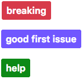
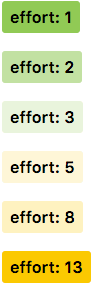
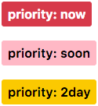
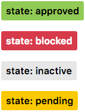
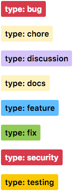

# how-to-write-the-perfect-pull-request

## Conventional Commits
Conventional Commit which is a great practice among engineering teams. Conventional Commit is a formatting convention that provides a set of rules to formulate a consistent commit message structure like so:

```
<type>[optional scope]: <description>

[optional body]

[optional footer(s)] 
```

### Types of commit messages 
The commit type can include the following:

- feat – a new feature is introduced with the changes
- fix – a bug fix has occurred
- chore – changes that do not relate to a fix or feature and don't modify src or test files (for example updating dependencies)
- refactor – refactored code that neither fixes a bug nor adds a feature
- docs – updates to documentation such as a the README or other markdown files
- style – changes that do not affect the meaning of the code, likely related to code formatting such as white-space, missing semi-colons, and so on.
- test – including new or correcting previous tests
- perf – performance improvements
- ci – continuous integration related
- build – changes that affect the build system or external dependencies
- revert – reverts a previous commit

### The commit type subject line should be all lowercase with a character limit to encourage succinct descriptions.

### The optional commit body should be used to provide further detail that cannot fit within the character limitations of the subject line description.It is also a good location to utilize BREAKING CHANGE: <description> to note the reason for a breaking change within the commit.

### The footer is also optional. We use the footer to link the  issue that would be closed with these changes for example: Closes #2.

``` 
fix: fix foo to enable bar

This fixes the broken behavior of the component by doing xyz. 

BREAKING CHANGE
Before this fix foo wasn't enabled at all, behavior changes from <old> to <new>

Closes #4 
 ```
- Good

``` feat: improve performance with lazy load implementation for images
chore: update npm dependency to latest version
Fix bug preventing users from submitting the subscribe form
Update incorrect client phone number within footer body per client request 
```

- Bad

``` 
fixed bug on landing page <br>
Changed style <br>
oops<br>
I think I fixed it this time?<br>
empty commit messages
```

## Create GitHub Labels that are logical, colorful and sensible
### Label Groups
1. Standard <br>

2. Effort <br>

3. Priority <br>

4. State <br>

5. Type <br>


### Approach to writing a Pull Request
- Include the purpose of this Pull Request.
- Consider providing an overview of why the work is taking place (with any relevant links)
- Remember that anyone in the repo could be reading this Pull Request, so the content and tone may inform people other than those taking part, now or later.
- Be explicit about when you want feedback, if the Pull Request is work in progress, say so. A prefix of “[WIP]” in the title is a simple, common pattern to indicate that state.
- Be as graphical as possible use screenshots 
- Review your own PR before you assign it to others


